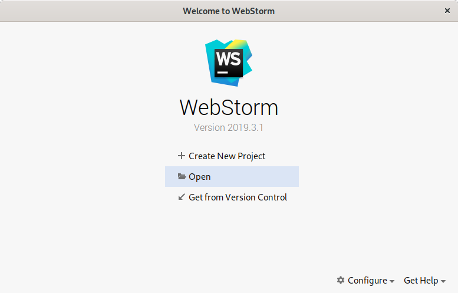
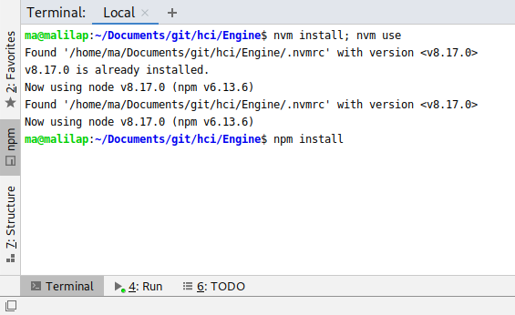
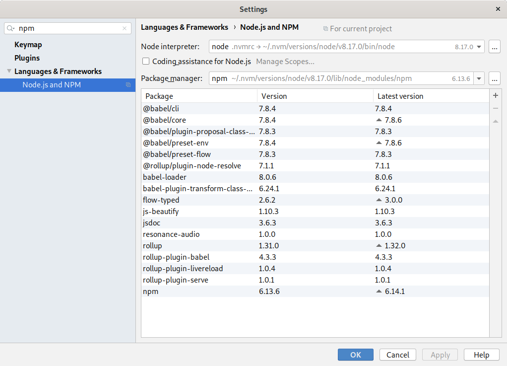
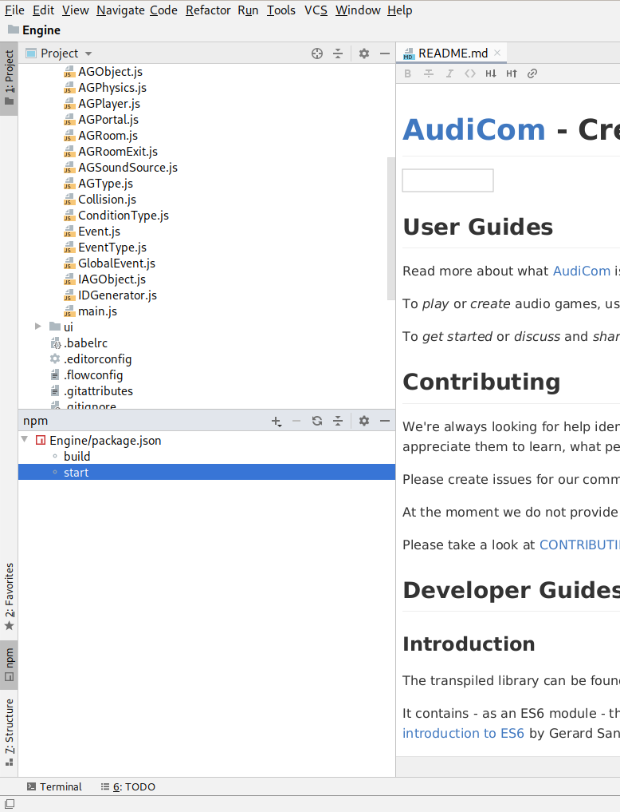
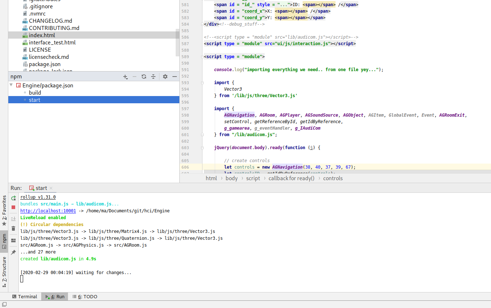

# Contributing to AudiCom

We're always looking for help identifying bugs and improving documentation. Our small team will
not be able to implement your new feature requests, however, we appreciate them to learn, what
people playing, creating and sharing audio games are caring about.

## Contributing as a Player or Game Creator

Please create issues for our comments, bug reports, recommendations, or feature requests on
https://github.com/AnTxXx/Engine/issues

At the moment we do not provide templates for these issue-types.

## Contributing as a Developer

In the following there are two guides. The first explains, how to set up a terminal-driven development workflow
agnostic to any IDE. The second explains, how to set up an IDE-driven development workflow using WebStorm as an
example. But there are two basic topics you should check first. If you don't learn anything new, that's cool, you
seem to be an expert already!

### Buildchain

This project is written in [flow](https://github.com/facebook/flow). The source is located in
[src](https://github.com/AnTxXx/Engine/tree/cleanup/src) and
[ui](https://github.com/AnTxXx/Engine/tree/cleanup/src). The source is transpiled to ES6 using
[babel](https://github.com/babel/babel) (See [.babelrc](https://github.com/AnTxXx/Engine/tree/cleanup/.babelrc)). Finally
the code is bundled using [rollupjs](https://github.com/rollup/rollup) (See
[rollup.config.js](https://github.com/AnTxXx/Engine/tree/cleanup/rollup.config.js)) creating 
[lib/audicom.js](https://github.com/AnTxXx/Engine/tree/cleanup/lib/audicom.js).

### Live Reload and ENOSPC

We have a live-reload feature in the buildchain, however this feature might have dependencies to your operating system
configuration (for background-info see https://nodejs.org/api/os.html). If e.g. you run a system that is limiting the
amount of open filehandles (`fs.inotify.max_user_watches`) it could potentially wrongly report there is no space left.
To solve this issue, which we only observed on linux systems, take a look at this discussion on NodeJs-Logs
(http://logs.nodejs.org/node.js/2019-12-29).

### Versioning

See [Semantic Versioning 2.0](https://semver.org/)

### Codestyle

See [.editorconfig](https://github.com/AnTxXx/Engine/tree/cleanup/.editorconfig).

### Workflow

See [GitFlow](https://www.gitflow.com/)

## ZSH based development setup

### Set Up Development Environment

Build scripts do not fail with node v8.17.0 and npm v6.13.6
Make sure your system is set up accordingly or use the *node version manager* (nvm, https://github.com/nvm-sh/nvm),
which only requires three commands to make sure node and npm are version locked.

    nvm install
    nvm use
    nvm install-latest-npm

To execute this build chain run:

    npm install
    npm run build

### Run Local Development Environment

To run a local server, serving all files including livereload do the following:

    npm start

If everything works as expected, you should be able to head over to http://localhost:10001/interface_test.html and see
a running instance of the editor. Once you change some JS file, [lib/audicom.js](https://github.com/AnTxXx/Engine/tree/cleanup/lib/audicom.js)
should be changed. If this does not work, your setup/environment differs from ours. Let's find out how and drop us an
issue!

Happy Hacking!

## IntelliJ based development setup

First clone this repository. Next open it in WebStorm - you do not have to create a new project.
If your IDE is not configured to accept configuration from the `.idea` folder you wont get our
settings, and will use your own.

Open Webstorms terminal and use `nvm` and `npm` as described above to install everything.

Make sure, everything is set up correctly, by opening File -> Settings -> Languages & Frameworks ->

Open the NPM tab - it should list all commands the project brings along:

And run your local instance, by right-clicking on the target and select "Run" or just double clicking it.

Using the debug profile to run the local webserver, will debug the webserver, not the Engine. You will
have to use the browsers built in features for debugging.